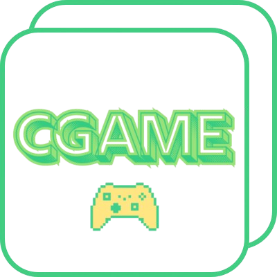

<p align="center">
  
</p>

<h1 align="center">CGAME</h1>

> **Ultra-lightweight, header-only C++ (with partial C compatibility) framework for GUI and rendering.**  
> Built from scratch for performance, clarity, and full developer control.  
> Created and maintained by **M. Hassnain K**.  

---

## 🧭 Overview

**cgame** is a **header-only**, **CPU-based**, **cross-compiler C++ framework** designed to give developers direct, low-level control over rendering and GUI systems — without the weight of traditional engines or external dependencies.  

Developed over a focused two-week period for **Windows**, cgame defines its own rendering pipeline, event system, and drawing interface entirely in C++, while maintaining the clean, minimal syntax that developers expect from modern libraries.  

Unlike wrappers or API bindings, **cgame *is* the framework** — written from the ground up to compete with large-scale libraries like **Raylib**, **SDL**, and **SFML** in speed, simplicity, and structure, but with **zero dependencies** beyond the C++ Standard Library.

---

## ⚙️ Core Features

- 🧩 **Header-only design** — easy to include, compile, and extend.  
- ⚡ **Pure CPU-based rendering** — deterministic and consistent on all hardware.  
- 🪶 **Lightweight architecture** — minimal binary size, minimal overhead.  
- 🧠 **Fully self-contained** — no external DLLs, link libraries, or hidden dependencies.  
- 🪟 **Custom GUI system** — includes primitives like rectangles, rounded rectangles, and images.  
- ⌨️ **Complete input handling** — built-in keyboard and mouse APIs.  
- 🧰 **Cross-compiler support** — tested with **MinGW** and **MSVC (Visual Studio 2022)**.  
- 🌍 **Cross-platform roadmap** — future versions will add Linux and macOS support.  

---

## 🧱 Design Philosophy

The vision behind **cgame** is to bring **clarity and full control** back into C++ graphical programming.  
Every function, event, and pixel in cgame is intentionally transparent — there are **no hidden abstractions**, **no opaque layers**, and **no unnecessary dependencies**.  

**cgame** was developed with three core principles:  

1. **Simplicity** — Code that is easy to read, modify, and extend.  
2. **Performance** — Predictable, real-time responsiveness using only CPU processing.  
3. **Transparency** — Every frame, event, and draw call is visible in source.  

The result is a library that feels closer to the metal — giving developers a deeper understanding of rendering, input, and GUI systems, while staying modern and elegant.

---

## 🧠 Architecture Overview

At its core, **cgame** consists of three main modules:

### 1. Display
Handles window creation, resizing, DPI awareness, and basic graphics API initialization.

```cpp
cgame.display.set_mode(int width, int height, int flags);
cgame.display.set_title(const char* title);
cgame.display.set_icon(const char* iconFilePath);
````

**Flags:**

* `CGAME_RESIZABLE` – Allows window resizing.
* `CGAME_DPI_AWARE` – Enables DPI correction/scaling.
* `CGAME_OPENGL` – Uses OpenGL as the rendering backend.
* `CGAME_VULKAN` – Uses Vulkan (planned).
* `CGAME_D3D12` – Uses DirectX 12 (MSVC only).

---

### 2. Event System

Handles all user input events (keyboard, mouse, and window system).

```cpp
int event = cgame.event.get();

if (event == cgame.QUIT)         // Quit event
if (event == cgame.KEYDOWN)      // Key pressed
if (event == cgame.KEYUP)        // Key released
if (event == cgame.VIDEORESIZE)  // Window resized
```

---

### 3. Drawing API

Provides simple but efficient drawing routines.

```cpp
cgame.draw.rect(x, y, w, h, r, g, b);                     // Outline rect
cgame.draw.fill_rect(x, y, w, h, r, g, b);                // Filled rect
cgame.draw.rounded_rect(x, y, w, h, radius, bw, r, g, b); // Rounded outline
cgame.draw.rounded_fill_rect(x, y, w, h, radius, r, g, b);// Rounded fill
```

**Images:**

```cpp
CGameImage image = cgame.image.load("icon.png");
cgame.image.draw(&image, 100, 100);
cgame.image.unload(&image);
```

---

### 4. Input System

Keyboard and mouse input are fully integrated.

```cpp
if (cgame.key.pressed(cgame.K_a))          // Key held
if (cgame.key.just_pressed(cgame.K_SPACE)) // Key pressed once
if (cgame.key.just_released(cgame.K_d))    // Key released

if (cgame.mouse.pressed(CGameButtonLeft))
if (cgame.mouse.just_pressed(CGameButtonRight))
if (cgame.mouse.just_released(CGameButtonMiddle))
```

---

## 🚀 Quick Example

```cpp
#include <cgame/cgame.h>

int main() {
    cgame.init();
    cgame.display.set_mode(800, 600, CGAME_RESIZABLE | CGAME_DPI_AWARE);
    cgame.display.set_title("Hello from cgame!");

    while (true) {
        if (cgame.event.get() == cgame.QUIT) break;
        cgame.draw.fill_rect(100, 100, 200, 150, 255, 0, 0);
    }

    cgame.quit();
}
```

---

## 🧩 Build Instructions

### 🪟 **MinGW**

Example `Makefile`:

```makefile
CXX       = g++
CXX_FLAGS = -Iinclude
LD_FLAGS  = -lopengl32 -lgdi32 -lgdiplus -lmsimg32 -lws2_32 -municode

SRC       = src/main.cpp
TARGET    = main.exe

all:
    $(CXX) $(CXX_FLAGS) $(SRC) -o $(TARGET) $(LD_FLAGS)

clean:
    rm -f *.exe *.o
```

Build manually:

```bash
g++ -Iinclude src/main.cpp -o main.exe -lopengl32 -lgdi32 -lgdiplus -lmsimg32 -lws2_32 -municode
```

---

### 🧱 **MSVC (Visual Studio 2022)**

Link the following libraries:

```
opengl32.lib
gdi32.lib
gdiplus.lib
msimg32.lib
ws2_32.lib
```

Then compile with `/std:c++17` or newer.

---

## 🧬 Roadmap

| Feature                              | Status                        | Notes             |
| ------------------------------------ | ----------------------------- | ----------------- |
| CPU-based rendering                  | ✅                            | Fully implemented |
| Input & event system                 | ✅                            | Stable            |
| Image loading/drawing                | ✅                            | Implemented       |
| Rounded GUI primitives               | ✅                            | Implemented       |
| OpenGL backend support               | ✅                            | Implemented       |
| Vulkan backend support               | ✅                            | Implemented       |
| DirectX 12 backend support           | ✅   (MSVC only)              | Implemented       |
| Cross-platform builds                | 🚧 In progress (Linux/macOS)  |                   |
| GUI widgets (buttons, sliders, etc.) | 🚧 Future update              |                   |

---

## 💭 Developer Motive

> “The goal was never to wrap an existing library — it was to *create one*.”

**cgame** was born from a desire to build a **true low-level C++ graphical framework** — something that could rival existing libraries in performance and design, but without external weight.

It’s designed to teach, to empower, and to run fast — giving developers a space where they can *see* what their code does, and *understand* how each frame is built.

---

## 🧾 License (zlib/libpng License)

[`License`](LICENSE.txt)
---

## 👤 Author

**Developed by:**
**M. Hassnain K**
Founder & Lead Developer of the **cgame framework**

> “Speed. Control. Simplicity.”

---

## 🌟 Final Notes

* cgame is currently optimized for **Windows**, with planned future ports.
* It’s 100% **open-source** and **community-driven** — contributions and ideas are always welcome.
* Whether you’re building a lightweight GUI, a visualization tool, or experimenting with rendering — **cgame** gives you the speed and control of pure C++.

---

> © 2025 M. Hassnain K — Released under the zlib/libpng License
> **cgame**: *A lightweight, CPU-based C and C++ framework for graphical freedom.*
